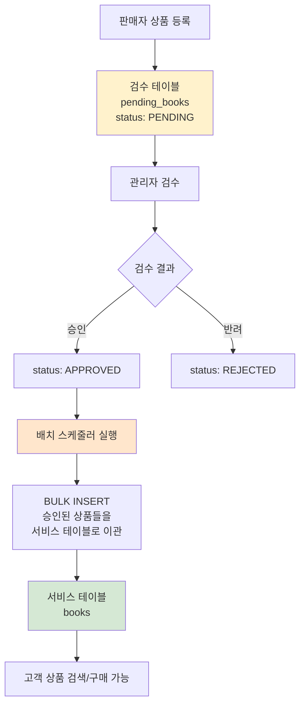
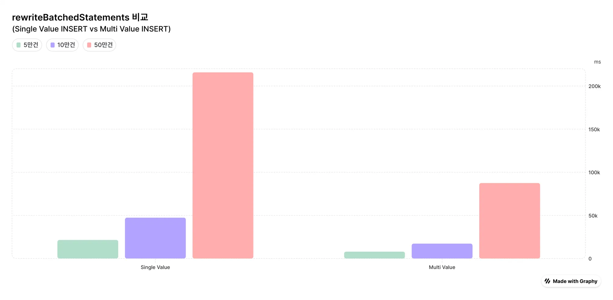
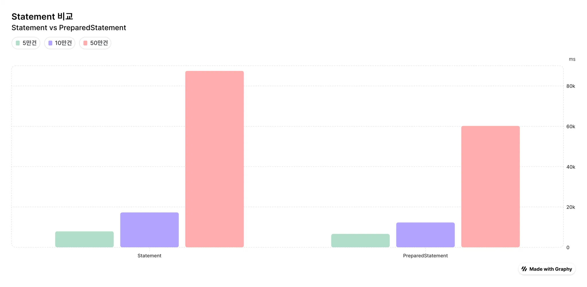
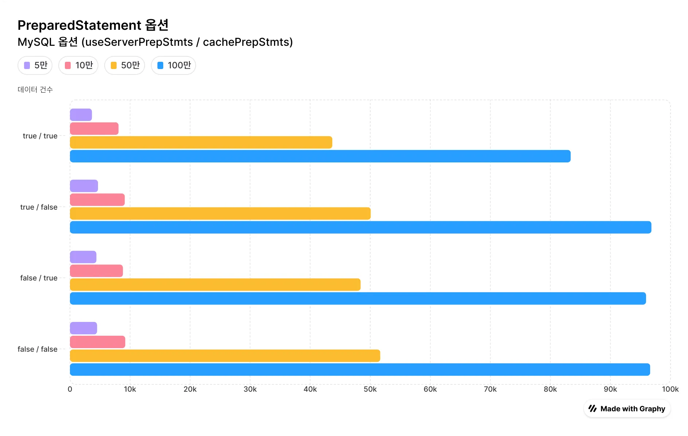
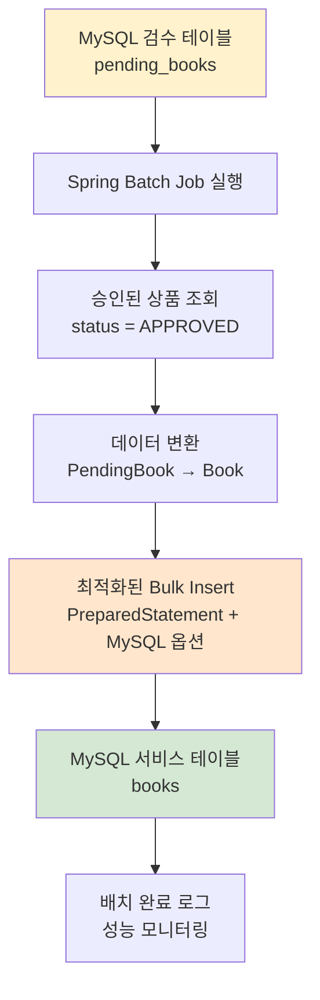

# CKIN 배치 - 대용량 Insert 성능 최적화 프로젝트

## 프로젝트 개요

이 프로젝트는 쇼핑몰 프로젝트에서 **상품 검수 프로세스의 성능 최적화**를 위한 배치 시스템입니다.

판매자가 등록한 상품이 바로 서비스에 노출되는 것이 아닌, **관리자 검수 -> 배치 처리**를 통해 실제 서비스 테이블로 이관되는 2단계 상품 관리 시스템을 구현했습니다.

---

## 시스템 아키텍처

### 사용자 역할 구성
- **관리자(Admin)**: 상품 검수 및 승인/반려 처리
- **판매자(Seller)**: 상품 등록 및 관리
- **고객(Customer)**: 승인된 상품 검색 및 구매

### 상품 관리 플로우



### 2단계 테이블 구조
1. **검수 테이블 (pending_books)**: 판매자가 등록한 상품들이 임시 저장되는 테이블
2. **서비스 테이블 (books)**: 검수 완료된 상품들이 실제 서비스에서 사용되는 테이블

---

## 성능 최적화 배경

### 문제 상황
초기에는 `JPA saveAll()`을 사용하여 승인된 상품들을 배치로 이관했습니다. 하지만 **예상보다 너무 느린 성능**이 문제였습니다.

```java
// 기존 방식 - JPA saveAll()
List<Book> approvedBooks = convertToBooks(approvedPendingBooks);
bookRepository.saveAll(approvedBooks); // 50만건 기준 215초 소요
```

### 원인 분석
JPA saveAll()로 대량 데이터를 처리할 때 발생하는 쿼리를 분석해본 결과:
- **단일 INSERT 쿼리가 반복 실행**되는 문제 발견
- Multi Value Insert가 아닌 개별 INSERT문이 계속 실행됨

```sql
-- 기존: 단일 INSERT 반복
INSERT INTO books (title, author, price) VALUES ('책1', '저자1', 10000);
INSERT INTO books (title, author, price) VALUES ('책2', '저자2', 15000);
INSERT INTO books (title, author, price) VALUES ('책3', '저자3', 20000);
-- ... (50만번 반복)

-- 개선: Multi Value INSERT  
INSERT INTO books (title, author, price) VALUES 
  ('책1', '저자1', 10000),
  ('책2', '저자2', 15000),
  ('책3', '저자3', 20000),
  -- ... (한 번에 여러 값 처리)
```

### 해결 방향
MySQL의 특정 옵션들을 활성화하여 **PreparedStatement + Batch Processing**을 최적화하기로 결정했습니다.

---

## INSERT 방식별 성능 비교

### 1. Single Value Insert vs Multi Value Insert



| **데이터 건수** | Single Value Insert (ms) | Multi Value Insert (ms) | **성능 개선** |
|------------|--------------------------|-------------------------|-------------|
| 50,000     | 21,445                   | **7,896**               | 63% 감소    |
| 100,000    | 47,312                   | **17,282**              | 63% 감소    |
| 500,000    | 215,819                  | **87,464**              | 59% 감소    |

**핵심**: `rewriteBatchedStatement=true` 옵션 활성화로 Multi Value Insert 사용

---

### 2. Statement vs PreparedStatement



| **데이터 건수** | Statement (ms) | PreparedStatement (ms) | **성능 개선** |
|------------|----------------|------------------------|-------------|
| 50,000     | 7,896          | **6,627**              | 16% 감소    |
| 100,000    | 17,282         | **12,311**             | 29% 감소    |
| 500,000    | 87,464         | **60,177**             | 31% 감소    |

**핵심**: PreparedStatement의 쿼리 재사용을 통한 성능 향상

---

### 3. MySQL PreparedStatement 옵션 최적화



| **데이터 건수** | useServerPrepStmts=true<br/>cachePrepStmts=true | useServerPrepStmts=true<br/>cachePrepStmts=false | useServerPrepStmts=false<br/>cachePrepStmts=true | useServerPrepStmts=false<br/>cachePrepStmts=false |
|------------|------------|------------|------------|-------------|
| 50,000     | **3,659**  | 4,669      | 4,401      | 4,517       |
| 100,000    | **8,090**  | 9,126      | 8,818      | 9,207       |
| 500,000    | **43,682** | 50,081     | 48,393     | 51,664      |
| 1,000,000  | **83,378** | 96,822     | 95,925     | 96,612      |

**핵심**: `useServerPrepStmts=true` + `cachePrepStmts=true` 조합이 최적 성능 제공

---

## MySQL PreparedStatement 심화 분석

### PreparedStatement의 진실
많은 개발자들이 오해하고 있는 부분이지만, **MySQL에서 PreparedStatement가 제대로 동작하려면 적절한 옵션 설정이 필수**입니다.

```yaml
# application.yml - 최적화된 MySQL 설정
spring:
  datasource:
    url: jdbc:mysql://localhost:3306/ckin_batch?rewriteBatchedStatements=true&useServerPrepStmts=true&cachePrepStmts=true&prepStmtCacheSize=250&prepStmtCacheSqlLimit=2048
```

### 옵션별 상세 설명
- **`rewriteBatchedStatements=true`**: 배치 INSERT를 Multi Value INSERT로 재작성
- **`useServerPrepStmts=true`**: 서버 사이드 PreparedStatement 사용
- **`cachePrepStmts=true`**: PreparedStatement 캐싱 활성화
- **`prepStmtCacheSize=250`**: 캐시할 PreparedStatement 개수
- **`prepStmtCacheSqlLimit=2048`**: 캐시할 SQL 문자열 최대 길이

> default 값이 생각보다 낮기 때문에, 적절하게 조정하는 것이 매우 중요

## 최종 성능 결과

### Before vs After
```
최적화 전 (JPA saveAll): 215.8초 (50만건)
최적화 후 (PreparedStatement + MySQL 옵션): 43.7초 (50만건)

성능 향상: 약 80% 개선 (215초 → 43초)
```

### 실제 비즈니스 임팩트
- **상품 이관 배치 처리 시간 대폭 단축**
- **시스템 자원 사용량 최적화**
- **고객이 새로운 상품을 더 빠르게 확인 가능**

## 전체 데이터 흐름



## 참고 자료

- [MySQL Connector/J 설정 옵션](https://dev.mysql.com/doc/connector-j/8.0/en/connector-j-reference-configuration-properties.html)
- [카카오페이 - PreparedStatement는 어떻게 동작하고 있는가](https://tech.kakaopay.com/post/how-preparedstatement-works-in-our-apps/)
- [Vlad Mihalcea - MySQL JDBC Statement Caching](https://vladmihalcea.com/mysql-jdbc-statement-caching/)
- [HikariCP - MySQL 설정 가이드](https://github.com/brettwooldridge/hikaricp/wiki/MYSQL-Configuration)


